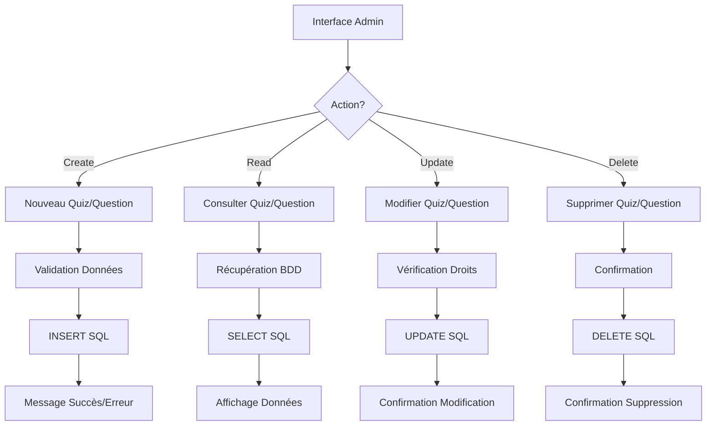

# Dossier de Projet : Quiz Master Dev

## Page de Garde

### Titre du Projet : Quiz Master Dev 2025

**Nom :** VOTRE NOM

**Formation :** Développeur Web et Web Mobile

**Établissement :** VOTRE ÉTABLISSEMENT

**Année Académique :** 2024-2025


## Table des Matières

1. [Introduction](#1-introduction)
2. [Présentation du Projet](#2-présentation-du-projet)
3. [Objectifs du Projet](#3-objectifs-du-projet)
4. [Spécifications Fonctionnelles](#4-spécifications-fonctionnelles)
5. [Spécifications Techniques](#5-spécifications-techniques)
6. [Architecture du Projet](#6-architecture-du-projet)
7. [Réalisation](#7-réalisation)
8. [Tests et Validation](#8-tests-et-validation)
9. [Conclusion](#9-conclusion)
10. [Annexes](#10-annexes)
11. [Évolutions Futures (V2)](#11-évolutions-futures-v2)

## 1. Introduction

### Brève description de la plateforme Quiz Master Dev

QUIZ-MASTER-DEV-2025 est une plateforme interactive de quiz en ligne développée en PHP. Le projet permet aux utilisateurs de participer à des quiz sur différents sujets, notamment le développement web (HTML, CSS, JavaScript), et aux administrateurs de gérer le contenu de la plateforme. L'application offre une expérience d'apprentissage ludique et interactive, tout en fournissant aux administrateurs les outils nécessaires pour gérer et analyser l'activité des utilisateurs.

### Contexte du projet

Ce projet a été réalisé dans le cadre de ma formation de Développeur Web et Web Mobile. Il répond à un besoin de créer une application web complète, mettant en pratique les compétences acquises en développement front-end et back-end. L'objectif était de concevoir une plateforme qui soit à la fois utile pour les utilisateurs et un exemple concret de développement web moderne.

### Public cible

Quiz Master Dev s'adresse à deux types de public :

- **Les joueurs :** Étudiants, professionnels, ou toute personne souhaitant tester et améliorer ses connaissances dans divers domaines, en particulier le développement web.

- **Les administrateurs :** Formateurs, enseignants, ou responsables de formation qui ont besoin d'un outil pour créer et gérer des quiz pour leurs apprenants.


## 2. Présentation du Projet

### Description détaillée de l'application

QUIZ-MASTER-DEV-2025 est une plateforme web qui permet de créer et de participer à des quiz en ligne. Elle est composée de deux parties principales :

- Une interface utilisateur pour les joueurs, leur permettant de s'inscrire, de se connecter, de choisir un quiz, de répondre aux questions, de consulter leurs résultats et de gérer leur profil.

- Une interface d'administration pour les administrateurs, leur permettant de gérer les utilisateurs, de créer, modifier et supprimer des quiz et des questions, de gérer les catégories de quiz, et de consulter des statistiques sur l'activité de la plateforme.

### Fonctionnalités principales

Le projet offre les fonctionnalités suivantes :

**Pour les joueurs :**

- Inscription et connexion sécurisées
- Navigation facile et intuitive dans le catalogue de quiz
- Participation à des quiz avec différents types de questions
- Affichage des résultats détaillés après chaque quiz
- Suivi de la progression et des scores personnels dans un tableau de bord dédié
- Personnalisation du profil utilisateur avec choix d'avatar
- **Partage des résultats sur les réseaux sociaux** grâce à l'API Web Share

**Pour les administrateurs :**

- Gestion complète des comptes utilisateurs (création, modification, suppression, rôles)
- Création, modification et suppression de quiz, questions et réponses
- Organisation des quiz par catégories et niveaux de difficulté
- Consultation de statistiques et de rapports sur l'activité des joueurs et des quiz
- Gestion de la sécurité de la plateforme


Un schéma de flux utilisateur (User Flow en anglais) est une représentation visuelle du parcours qu'un utilisateur suit pour accomplir une tâche spécifique dans l'application. Dans le contexte de Quiz Master Dev, ce schéma devrait montrer :

```markdown
graph TD
    A[Accueil] --> B{Utilisateur connecté?}
    B -->|Non| C[Page de connexion]
    B -->|Oui| D[Dashboard]
    D --> E[Sélection Quiz]
    E --> F[Quiz en cours]
    F --> G[Résultats]
    G --> H[Partage]
```

## 3. Objectifs du Projet

### Objectifs fonctionnels

- Créer une plateforme de quiz intuitive et conviviale, accessible à tous types d'utilisateurs.
- Permettre aux joueurs de participer à des quiz de manière interactive et motivante.
- Fournir aux administrateurs un outil complet pour gérer le contenu de la plateforme de manière efficace.
- Assurer une expérience utilisateur fluide et agréable sur tous les appareils (ordinateur, tablette, mobile).

### Objectifs techniques

- Assurer la sécurité des données et des utilisateurs en mettant en place des mécanismes de protection contre les attaques courantes (injections SQL, XSS, CSRF).
- Proposer une structure évolutive pour de futures améliorations et l'ajout de nouvelles fonctionnalités.
- Utiliser des technologies web modernes et performantes (PHP, MySQL, HTML, CSS, JavaScript).
- Respecter les standards du web et les bonnes pratiques de développement.

### Objectifs d'apprentissage

- Approfondir mes connaissances en développement web full-stack (front-end et back-end).
- Maîtriser l'architecture MVC et son application dans un projet concret.
- Développer des compétences en conception de base de données et en requêtes SQL.
- Mettre en pratique les principes de sécurité web et de protection des données.
- Améliorer mes compétences en gestion de projet, en particulier la planification, l'organisation et la documentation.

## 4. Spécifications Fonctionnelles

### Détail des fonctionnalités de l'application

#### Pour les Joueurs :

- **Inscription et connexion :** Les joueurs peuvent créer un compte et se connecter à la plateforme de manière sécurisée.
- **Participation à des quiz :**
  - Sélection d'un quiz parmi une liste organisée par catégories et niveaux de difficulté
  - Affichage des questions une par une avec leurs options de réponse
  - Calcul automatique du score en fonction des réponses correctes
  - Chronomètre optionnel pour limiter le temps de réponse
- **Système de scores et résultats :**
  - Affichage détaillé des résultats à la fin de chaque quiz (score, réponses correctes/incorrectes)
  - Historique des quiz joués et des scores obtenus
  - Visualisation des statistiques personnelles (moyenne, meilleur score, progression)
- **Partage social :**
  - Partage des résultats de quiz via l'API Web Share sur diverses plateformes (réseaux sociaux, applications de messagerie)
  - Options de personnalisation du message de partage incluant le score obtenu
- **Modification du profil :** Les joueurs peuvent modifier leurs informations personnelles, comme leur nom, leur avatar, et leur mot de passe.

### Fonctionnalités prévues pour la version 2.0

#### Système de Scores et Badges

Le système de récompenses sera enrichi dans la version 2.0 avec :

1. **Système de Points**
   - Points de base pour chaque réponse correcte
   - Bonus de rapidité selon le temps de réponse
   - Multiplicateurs selon le niveau de difficulté
   - Points bonus pour les séries de bonnes réponses

2. **Badges et Accomplissements**
   - Badges de progression (Débutant, Intermédiaire, Expert)
   - Badges thématiques par catégorie (Maître HTML, Guru CSS, etc.)
   - Badges spéciaux (Premier Quiz, 10 Quiz parfaits, etc.)
   - Badges de participation (7 jours consécutifs, etc.)

3. **Tableau des scores**
   - Classement général des joueurs
   - Classements par catégorie
   - Classements hebdomadaires et mensuels
   - Historique personnel des scores

4. **Statistiques détaillées**
   - Taux de réussite par catégorie
   - Temps moyen de réponse
   - Progression dans le temps
   - Analyse des points forts et faibles

_Note: Ces fonctionnalités sont en cours de développement et seront disponibles dans la version 2.0 de l'application._

#### Pour les Administrateurs :

- **Gestion des utilisateurs :** Les administrateurs peuvent voir la liste des utilisateurs, modifier leurs informations, changer leur rôle (joueur, administrateur), et désactiver des comptes.
  - _Note: La fonctionnalité CRUD complète pour les joueurs (ajout, modification, suppression par l'administrateur) est prévue pour la version 2.0 du projet_
- **Gestion des questions :** Les administrateurs peuvent créer de nouveaux quiz, ajouter, modifier et supprimer des questions (avec différents types de réponses possibles), et organiser les questions en catégories.
- **Gestion des catégories de quiz :** Les administrateurs peuvent créer, modifier et supprimer des catégories et des niveaux de difficulté pour organiser le contenu.
- **Statistiques et rapports :** Les administrateurs peuvent consulter des statistiques sur l'activité de la plateforme, comme le nombre de joueurs inscrits, les quiz les plus populaires, et les résultats moyens des joueurs.
_Note: Ces fonctionnalités sont en cours de développement et seront disponibles dans la version 2.0 de l'application._

### Cas d'utilisation


```markdown
graph TD
    A((Joueur)) --> B[S'inscrire/Se connecter]
    A --> C[Participer à un quiz]
    A --> D[Consulter scores]
    A --> E[Gérer profil]
    
    F((Admin)) --> G[Gérer questions]
    F --> H[Gérer utilisateurs]
    F --> I[Créer/Modifier quiz]
    F --> J[Consulter stats]
```

## 5. Spécifications Techniques

### Environnement de développement

Le projet a été développé sur un environnement de développement composé des éléments suivants :

- **Système d'exploitation :** Windows 10
- **Serveur web :** Apache 2.4 (WampServer)
- **SGBD :** MySQL 8.0
- **Éditeur de code :** Visual Studio Code
- **Outils de gestion de projet :** Git, GitHub

### Langages de programmation utilisés

Les langages de programmation utilisés pour développer Quiz Master Dev sont :

- **PHP 8.0 :** Langage de script côté serveur pour la logique applicative et l'interaction avec la base de données.
- **HTML5 :** Langage de balisage pour la structure et le contenu des pages web.
- **CSS3 :** Langage de style pour la présentation et l'apparence des pages web.
- **JavaScript ES6 :** Langage de script côté client pour l'interactivité et les fonctionnalités dynamiques de l'interface utilisateur.
- **SCSS :** Préprocesseur CSS pour une meilleure organisation et maintenance du code CSS.

### Technologies de communication

#### Format d'échange de données JSON

L'application utilise JSON (JavaScript Object Notation) pour :

- **Communication Client-Serveur** : Échange de données entre le navigateur et le serveur
- **API REST** : Format standardisé pour les requêtes et réponses
- **Stockage de configurations** : Certains paramètres de l'application

Exemple d'utilisation dans l'application :

```javascript
// Côté client (JavaScript)
async function submitQuizAnswer(questionData) {
    const response = await fetch('/submitAnswer', {
        method: 'POST',
        headers: {
            'Content-Type': 'application/json'
        },
        body: JSON.stringify({
            questionId: questionData.id,
            answerId: questionData.selectedAnswer,
            quizId: questionData.quizId,
            timeSpent: questionData.timer
        })
    });
    return await response.json();
}
```

```php
// Côté serveur (PHP)
public function getJsonData() {
    $jsonData = file_get_contents('php://input');
    return json_decode($jsonData, true);
}
```
Avantages de l'utilisation du JSON :

Format léger et facile à lire
Support natif dans JavaScript et PHP
Parfaitement adapté aux applications web modernes
Facilite les mises à jour dynamiques de l'interface

### Frameworks et librairies

Le projet utilise les frameworks et librairies suivantes :

- **Architecture MVC personnalisée :** Framework PHP maison pour structurer l'application selon l'architecture MVC.
- **Bootstrap 4.5 :** Framework CSS pour la création d'une interface utilisateur responsive et esthétique.
- **jQuery 3.5 :** Bibliothèque JavaScript pour faciliter les manipulations DOM et les requêtes AJAX.
- **API Web Share :** API native des navigateurs permettant le partage de contenu sur les réseaux sociaux et autres applications.

### Base de données

La base de données utilisée est MySQL. Elle permet de stocker de manière structurée les données de l'application, telles que les informations des utilisateurs, les quiz, les questions, les réponses, et les résultats.

### Architecture logicielle

Le projet suit une architecture logicielle MVC (Modèle-Vue-Contrôleur). Cette architecture permet de séparer les différentes parties de l'application (données, présentation, logique) pour faciliter le développement, la maintenance et l'évolutivité.

| Technologie    | Rôle                                                                  |
| -------------- | --------------------------------------------------------------------- |
| PHP 8.0        | Logique applicative côté serveur, interaction avec la base de données |
| HTML5          | Structure et contenu des pages web                                    |
| CSS3/SCSS      | Style et présentation des pages web                                   |
| JavaScript ES6 | Interactivité et fonctionnalités dynamiques côté client               |
| MySQL 8.0      | Stockage des données de l'application                                 |
| Bootstrap 4.5  | Framework CSS pour une interface responsive                           |
| jQuery 3.5     | Bibliothèque JS pour manipulations DOM et requêtes AJAX               |

## 6. Architecture du Projet

### Description de l'architecture MVC

Le projet suit une architecture MVC (Modèle-Vue-Contrôleur) pour assurer une séparation claire des responsabilités :

- **Modèle :** Gère l'accès aux données et les opérations sur la base de données. Les modèles sont responsables de la logique métier et de la manipulation des données.

- **Vue :** S'occupe de l'affichage et de l'interface utilisateur. Les vues sont des templates qui présentent les données à l'utilisateur.

- **Contrôleur :** Orchestre les interactions entre le modèle et la vue, traite les requêtes de l'utilisateur, récupère les données du modèle et les transmet à la vue pour l'affichage. Les contrôleurs agissent comme intermédiaires entre les modèles et les vues.

#### Exemple concret : Gestion d'une question par l'administrateur

Voici un exemple illustrant le fonctionnement de l'architecture MVC lorsqu'un administrateur modifie une question :

1. **Interaction utilisateur :**
   - L'administrateur se connecte au tableau de bord et clique sur "Modifier" à côté d'une question.

2. **Contrôleur (`QuestionController.php`) :**
   ```php
   <?php
   // controllers/QuestionController.php
   class QuestionController {
       private $questionModel;
       
       public function edit($id) {
           // Logique de récupération et affichage
       }
       
       public function update($id) {
           // Logique de mise à jour
       }
   }
   ```

3. **Modèle (`QuestionModel.php`) :**
   ```php
   public function getQuestionById($id) {
       // Requête SQL préparée pour éviter les injections
       $query = $this->db->prepare('
           SELECT q.*, c.name as category_name, d.level as difficulty_level
           FROM quiz_question q
           LEFT JOIN quiz_question_category c ON q.Id_category = c.Id_category
           LEFT JOIN quiz_question_difficulte d ON q.Id_difficulte = d.Id_difficulte
           WHERE q.Id_question = ?
       ');
       
       $query->execute([$id]);
       return $query->fetch();
   }
   ```

4. **Vue (`views/admin/questions/edit.php`) :**
   ```php
   <div class="admin-card">
       <h2>Modifier la question</h2>
       
       <form method="post" action="index.php?action=updateQuestion">
           <input type="hidden" name="id" value="<?= htmlspecialchars($question['Id_question']) ?>">
           
           <div class="form-group">
               <label for="question-text">Texte de la question</label>
               <textarea id="question-text" name="text" class="form-control" required><?= htmlspecialchars($question['text']) ?></textarea>
           </div>
           
           <div class="form-group">
               <label for="category">Catégorie</label>
               <select id="category" name="category" class="form-control">
                   <?php foreach($categories as $category): ?>
                   <option value="<?= $category['Id_category'] ?>" <?= $question['Id_category'] == $category['Id_category'] ? 'selected' : '' ?>>
                       <?= htmlspecialchars($category['name']) ?>
                   </option>
                   <?php endforeach; ?>
               </select>
           </div>
           
           <!-- Autres champs du formulaire... -->
           
           <div class="form-actions">
               <a href="index.php?action=questions" class="btn btn-secondary">Annuler</a>
               <button type="submit" class="btn btn-primary">Enregistrer les modifications</button>
           </div>
       </form>
   </div>
   ```

5. **Flux complet :**
   - L'URL `index.php?action=editQuestion&id=123` est demandée par l'administrateur
   - Le routeur analyse l'URL et appelle la méthode `editQuestion(123)` du `QuestionController`
   - Le contrôleur vérifie les permissions, puis demande au `QuestionModel` de récupérer les données
   - Le modèle interroge la base de données et renvoie les informations de la question
   - Le contrôleur transmet ces données à la vue
   - La vue génère le HTML du formulaire d'édition avec les valeurs actuelles de la question
   - L'administrateur voit le formulaire pré-rempli et peut modifier la question

Cette séparation en MVC permet une maintenance plus facile (chaque partie peut être modifiée indépendamment) et favorise la réutilisation du code.

### Exemple d'une requête HTTP complète

Pour illustrer le fonctionnement de l'application, voici un exemple détaillé d'une requête HTTP depuis sa réception jusqu'à la réponse, lors de la soumission d'une réponse à une question de quiz :

1. **Requête HTTP initiale**
```http
POST /QUIZ-MASTER-DEV-2025/index.php?action=submitAnswer HTTP/1.1
Host: localhost
Content-Type: application/json
Authorization: Bearer SESSION_TOKEN_123
Content-Length: 89

{
    "questionId": 42,
    "answerId": 156,
    "quizId": 7,
    "timeSpent": 15
}
```

2. **Traitement par le routeur (`index.php`)**
```php
// Analyse de l'URL et redirection vers le contrôleur approprié
$action = $_GET['action'] ?? 'home';
$controller = new QuizController();
if ($action === 'submitAnswer') {
    $controller->submitAnswer();
}
```

3. **Traitement par le contrôleur (`QuizController.php`)**
```php
public function submitAnswer() {
    // Vérification de l'authentification
    if (!$this->isAuthenticated()) {
        $this->sendJsonResponse(['error' => 'Non autorisé'], 401);
        return;
    }

    // Récupération et validation des données
    $data = json_decode(file_get_contents('php://input'), true);
    if (!$this->validateAnswerData($data)) {
        $this->sendJsonResponse(['error' => 'Données invalides'], 400);
        return;
    }

    // Appel au modèle pour traiter la réponse
    $quizModel = new QuizModel();
    $result = $quizModel->processAnswer(
        $data['questionId'],
        $data['answerId'],
        $data['quizId'],
        $data['timeSpent']
    );

    // Envoi de la réponse
    $this->sendJsonResponse($result);
}
```

4. **Traitement par le modèle (`QuizModel.php`)**
```php
public function processAnswer($questionId, $answerId, $quizId, $timeSpent) {
    // Vérification de la réponse dans la base de données
    $query = $this->db->prepare('
        SELECT is_correct, points 
        FROM quiz_question_answer 
        WHERE Id_answer = ? AND Id_question = ?
    ');
    $query->execute([$answerId, $questionId]);
    $answer = $query->fetch();

    // Enregistrement de la réponse dans l'historique
    $this->saveAnswerHistory(
        $_SESSION['user_id'],
        $quizId,
        $questionId,
        $answerId,
        $answer['is_correct'],
        $timeSpent
    );

    return [
        'correct' => (bool)$answer['is_correct'],
        'points' => $answer['points'],
        'feedback' => $this->getFeedbackForAnswer($answerId)
    ];
}
```

5. **Réponse HTTP finale**
```http
HTTP/1.1 200 OK
Content-Type: application/json
X-Powered-By: PHP/8.0.0

{
    "correct": true,
    "points": 10,
    "feedback": "Excellente réponse ! L'utilisation de la balise <header> est en effet appropriée pour le contenu d'en-tête."
}
```

### Diagramme de séquence

```markdown
sequenceDiagram
    participant C as Client (Navigateur)
    participant R as Router (index.php)
    participant Co as Controller
    participant M as Model
    participant DB as Base de données

    C->>R: POST /index.php?action=submitAnswer
    Note over C,R: {questionId: 42, answerId: 156,...}

    R->>Co: submitAnswer()
    Note over R,Co: Redirection vers QuizController

    Co->>Co: isAuthenticated()
    Note over Co: Vérification session

    Co->>Co: validateAnswerData()
    Note over Co: Validation données

    Co->>M: processAnswer()
    Note over Co,M: Transmission des données validées

    M->>DB: SELECT query
    Note over M,DB: Vérification réponse

    DB-->>M: Résultat requête
    Note over DB,M: {is_correct, points}

    M->>DB: INSERT history
    Note over M,DB: Sauvegarde historique

    M-->>Co: Retour résultat
    Note over M,Co: {correct, points, feedback}

    Co-->>C: JSON Response 200 OK
    Note over Co,C: {"correct": true, "points": 10,...}
```

### Structure des dossiers et fichiers

```
QUIZ-MASTER-DEV-2025/
├── config/                  # Configuration (connexion BDD)
├── controllers/             # Contrôleurs (logique applicative)
│   └── QuestionController.php
├── core/                    # Classes fondamentales
│   └── Model.php            # Classe abstraite pour les modèles
├── models/                  # Modèles (accès aux données)
│   └── QuizModel.php        # Modèle pour les quiz
├── public/                  # Ressources publiques
│   ├── css/                 # Fichiers CSS compilés
│   ├── img/                 # Images
│   │   └── avatars/         # Avatars utilisateurs
│   ├── js/                  # Scripts JavaScript
│   └── scss/                # Fichiers SCSS source
├── uploads/                 # Fichiers téléchargés
│   └── questions/           # Images des questions
├── views/                   # Vues (templates)
│   ├── admin/               # Pages d'administration
│   ├── layout/              # Templates partagés (header, footer)
│   └── user/                # Pages utilisateur
│   └── quiz/                # Pages de quiz
│       └── results.php      # Résultats des quiz
├── documentation/           # Documentation du projet
└── index.php                # Point d'entrée
```

### Schéma de l'architecture


```markdown
graph TD
    %% Définition des styles
    classDef browser fill:#f9f,stroke:#333,stroke-width:2px
    classDef server fill:#9cf,stroke:#333,stroke-width:2px
    classDef component fill:#cfc,stroke:#333,stroke-width:2px
    classDef database fill:#fcf,stroke:#333,stroke-width:2px

    %% Composants
    Client[Navigateur Web]:::browser
    Router[Router]:::server
    Controller[QuizController]:::component
    Model[QuizModel]:::component
    View[Views]:::component
    DB[(Database)]:::database

    %% Connexions avec des labels simples
    Client -->|"Requête HTTP"| Router
    Router -->|"Route"| Controller
    Controller -->|"getData"| Model
    Model -->|"SQL"| DB
    DB -->|"Data"| Model
    Model -->|"Result"| Controller
    Controller -->|"Data"| View
    View -->|"HTML/JSON"| Client
```

##### Schéma du cycle CRUD



##### Exemple de code CRUD complet

```php
// Exemple de classe Controller implémentant le CRUD

class QuizController {
    // CREATE
    public function create() {
        if ($_SERVER['REQUEST_METHOD'] === 'POST') {
            $data = $this->validateQuizData($_POST);
            $quizId = $this->quizModel->insert($data);
            $this->redirect('/quiz/' . $quizId);
        }
    }

    // READ
    public function read($id) {
        $quiz = $this->quizModel->getById($id);
        $this->render('quiz/view', ['quiz' => $quiz]);
    }

    // UPDATE
    public function update($id) {
        if ($_SERVER['REQUEST_METHOD'] === 'POST') {
            $data = $this->validateQuizData($_POST);
            $this->quizModel->update($id, $data);
            $this->redirect('/quiz/' . $id);
        }
    }

    // DELETE
    public function delete($id) {
        if ($_SERVER['REQUEST_METHOD'] === 'POST') {
            $this->quizModel->delete($id);
            $this->redirect('/quiz/list');
        }
    }
}
```

Cette implémentation garantit :
- La validation des données entrantes
- La gestion des erreurs
- La sécurité des opérations
- La traçabilité des actions
- Le retour d'information à l'utilisateur

## 7. Réalisation

### 7.1. Étapes de la Réalisation

#### Planning prévisionnel du projet

Le projet a été réalisé selon le planning suivant :

| Semaine      | Période           | Étapes                                           |
| ------------ | ----------------- | ------------------------------------------------ |
| Semaine 1    | 15-21 février     | Expression des besoins, définition des objectifs |
| Semaine 2    | 22-28 février     | Définition de l'environnement technique          |
| Semaine 3    | 29 février-6 mars | Conception des maquettes et wireframes           |
| Semaine 4-5  | 7-20 mars         | Conception MCD/MLD, diagrammes UML               |
| Semaine 6-11 | 21 mars-5 mai     | Développement back-end et front-end              |
| Semaine 12   | 6-12 mai          | Phase de tests et débogage                       |

#### Chronologie des étapes du projet

La réalisation du projet Quiz Master Dev s'est déroulée selon les étapes suivantes :

1. **Analyse des besoins et spécifications :**

   - Définition des exigences fonctionnelles et techniques
   - Création d'un cahier des charges

2. **Conception :**

   - Création de wireframes pour définir la structure des pages
   - Conception des maquettes graphiques
   - Modélisation de la base de données
   - Choix des technologies

3. **Développement :**

   - Mise en place de l'environnement de développement
   - Création de la structure du projet
   - Développement du back-end (modèles, contrôleurs)
   - Développement du front-end (vues, intégration HTML/CSS/JS)

4. **Tests :**

   - Tests unitaires des composants
   - Tests d'intégration
   - Tests fonctionnels
   - Tests de sécurité

5. **Déploiement :**

   - Préparation pour le déploiement
   - Configuration du serveur
   - Déploiement de l'application

6. **Documentation :**
   - Rédaction de la documentation technique
   - Rédaction du guide utilisateur
   - Rédaction du dossier de projet

#### Choix de conception et difficultés rencontrées

Lors de la conception de Quiz Master Dev, plusieurs choix ont été faits :

- Utilisation de l'architecture MVC personnalisée pour une meilleure structure
- Adoption d'une approche orientée objet pour le développement PHP
- Utilisation de SCSS pour organiser le CSS de manière modulaire
- Implémentation d'un système de routage simple et efficace

Les principales difficultés rencontrées ont été :

- La mise en place du système d'authentification avec différents rôles
- La gestion des images téléchargées pour les questions
- L'implémentation du système de suppression des questions avec gestion des contraintes de clés étrangères
- La création d'une interface responsive adaptée à tous les appareils

#### Solutions apportées

Pour surmonter ces difficultés, les solutions suivantes ont été mises en œuvre :

- Développement d'un système d'authentification robuste avec sessions PHP et hachage des mots de passe
- Création d'un gestionnaire de fichiers pour les images de questions avec validation des types et tailles
- Implémentation d'une gestion transactionnelle pour les suppressions en cascade
- Utilisation de media queries et de CSS flexbox pour assurer la responsivité

### 7.2. Maquettes

#### Présentation des wireframes et des maquettes graphiques

Les wireframes et les maquettes graphiques ont été créés pour définir l'interface utilisateur de Quiz Master Dev.

Les wireframes ont permis de définir la structure des pages, la disposition des éléments, et le flux de navigation. Ils ont été réalisés à l'aide de FIGMA.

Les maquettes graphiques ont ensuite été créées pour donner une apparence visuelle à l'application. Elles définissent les couleurs, les typographies, les images, et les autres éléments graphiques. Elles ont été réalisées avec Figma.

#### Outils utilisés pour la conception

Les outils utilisés pour la conception de l'interface utilisateur sont :

- Figma pour les wireframes
- Figma pour les maquettes graphiques

#### Justification des choix de design

Les choix de design ont été guidés par les principes suivants :

- **Simplicité et clarté :** L'interface est conçue pour être intuitive et facile à utiliser.
- **Cohérence :** Une identité visuelle cohérente est maintenue à travers toute l'application.
- **Accessibilité :** Le design respecte les standards d'accessibilité pour être utilisable par tous.
- **Modernité :** Des éléments de design contemporains sont utilisés pour une expérience agréable.
- **Responsivité :** L'interface s'adapte à tous les types d'écrans.

Les couleurs principales (#0071e3 et #1d1d1f) ont été choisies pour leur contraste et leur association au domaine technologique. La typographie sans-serif a été sélectionnée pour sa lisibilité sur écran.


### 7.2.1 Captures d'écran de l'Application

#### Interface Administrateur


*Dashboard principal de l'administrateur permettant la gestion globale de la plateforme*

#### Gestion des Quiz

*Interface de gestion des quiz avec les options CRUD*

#### Interface Utilisateur

*Page d'accueil présentant les différents quiz disponibles*


*Interface de jeu pendant un quiz*

#### Tableaux de Bord

*Dashboard utilisateur montrant les statistiques et la progression*

#### Interface Mobile

*Aperçu de l'application sur mobile démontrant la responsivité*

### 7.3. Intégration

#### Technologies utilisées (HTML5, CSS3, SASS, JavaScript)

L'intégration de l'interface utilisateur a été réalisée en utilisant les technologies suivantes :

- **HTML5 :** Pour la structure et le contenu des pages web.
- **CSS3/SCSS :** Pour la mise en forme et le style, avec SCSS pour une meilleure organisation.
- **JavaScript ES6 :** Pour l'interactivité et les fonctionnalités dynamiques, notamment pour le système de quiz et la gestion des réponses.
- **jQuery :** Pour simplifier les manipulations DOM et les requêtes AJAX.
- **API Web Share :** Implémentation de l'API native pour permettre le partage des résultats sur différentes plateformes.

#### Organisation du code

Le code CSS est organisé en modules SCSS :

- `_variables.scss` : Variables globales (couleurs, typographie)
- `style.scss` : Fichier principal important tous les modules
- `_layout.scss` : Structure générale et mise en page commune
- `_home.scss` : Styles spécifiques à la page d'accueil
- `_admin_dashboard.scss` : Styles spécifiques au tableau de bord administrateur
- `_player_dashboard.scss` : Styles spécifiques au tableau de bord joueur
- `_quiz.scss` : Styles spécifiques aux pages de quiz

Cette organisation modulaire permet de maintenir un code bien structuré où chaque fonctionnalité principale dispose de son propre fichier de style, tout en partageant des éléments communs via le fichier principal. Cette approche facilite la maintenance et l'évolution future du projet.

#### Système de gestion des avatars

Un système complet de gestion des avatars a été implémenté pour permettre aux utilisateurs de personnaliser leur profil :

1. **Structure de données** :

   - Table `quiz_avatar` dans la base de données qui stocke les identifiants uniques (Id_Avatar) pour chaque avatar disponible
   - Correspondance directe entre les entrées de la base de données et les fichiers physiques d'images

2. **Organisation des fichiers** :

   - Les images des avatars sont stockées dans le dossier `public/img/avatars/`
   - Chaque avatar est nommé selon la convention `avatar{Id_Avatar}.png` (ex: avatar1.png, avatar2.png, etc.)
   - Cette convention permet une liaison automatique entre l'ID stocké en base de données et le fichier correspondant

3. **Fonctionnalités utilisateur** :
   - **Lors de l'inscription** : L'utilisateur peut sélectionner son avatar parmi les options disponibles affichées sous forme de galerie
   - **Modification du profil** : L'utilisateur peut changer son avatar à tout moment depuis son espace personnel
4. **Mise en œuvre technique** :

   - Les avatars disponibles sont récupérés dynamiquement de la base de données et affichés à l'utilisateur
   - Lors de la sélection, seul l'ID de l'avatar est stocké dans la table `quiz_users`
   - À l'affichage, le chemin de l'image est généré dynamiquement en combinant le chemin du dossier et l'ID stocké

5. **Avantages de cette approche** :
   - Facilité de maintenance : ajouter un nouvel avatar ne nécessite que l'ajout d'une entrée en base de données et du fichier image correspondant
   - Économie d'espace de stockage : seul l'identifiant est stocké dans la table utilisateurs
   - Flexibilité : possibilité d'ajouter des métadonnées aux avatars (nom, catégorie, etc.) dans la table `quiz_avatar` si nécessaire

Cette implémentation offre une expérience utilisateur engageante tout en maintenant une architecture de données optimisée et facilement extensible.

#### Responsivité

L'application est entièrement responsive grâce à :

- L'utilisation de media queries pour adapter l'affichage aux différentes tailles d'écran
- L'implémentation de flexbox et grid pour des layouts flexibles
- Des images et polices responsives qui s'adaptent à l'écran

```scss
// Exemple de code SCSS pour la responsivité
@media (max-width: 768px) {
  .form-actions {
    flex-direction: column;
    gap: 15px;

    .btn {
      width: 100%;
    }
  }
}
```

```javascript
// Exemple de code JavaScript pour la gestion des quiz
document.addEventListener("DOMContentLoaded", function () {
  const quizForm = document.getElementById("quiz-form");

  if (quizForm) {
    quizForm.addEventListener("submit", function (e) {
      e.preventDefault();

      // Collecter les réponses
      const answers = {};
      const inputs = quizForm.querySelectorAll('input[type="radio"]:checked');

      inputs.forEach((input) => {
        answers[input
```

### Intégration de l'API Web Share

#### Présentation
J'ai choisi d'implémenter l'API Web Share pour permettre aux utilisateurs de partager facilement leurs résultats de quiz sur différentes plateformes. Cette API native offre une solution élégante et moderne qui s'intègre parfaitement aux fonctionnalités de partage du système d'exploitation.

#### Implémentation Technique

1. **JavaScript pour le partage**
```javascript
// public/js/shareResults.js
class QuizShareManager {
    constructor() {
        this.shareButton = document.querySelector('.share-results-btn');
        this.initShareFeature();
    }

    initShareFeature() {
        // Vérification de la compatibilité du navigateur
        if (!navigator.share) {
            this.shareButton.style.display = 'none';
            return;
        }

        this.shareButton.addEventListener('click', (e) => this.handleShare(e));
    }

    async handleShare(event) {
        event.preventDefault();
        const quizData = this.getQuizData();

        try {
            await navigator.share({
                title: 'Mon score sur Quiz Master Dev!',
                text: `J'ai obtenu ${quizData.score} points sur le quiz "${quizData.quizTitle}"! 🎯`,
                url: window.location.href
            });
            console.log('Partage réussi!');
        } catch (err) {
            console.warn('Erreur lors du partage:', err.message);
        }
    }

    getQuizData() {
        return {
            score: document.querySelector('[data-quiz-score]').dataset.quizScore,
            quizTitle: document.querySelector('[data-quiz-title]').dataset.quizTitle
        };
    }
}
```
2.  **HTML pour l'interface**
```html
<!-- views/quiz/results.php -->
<div class="quiz-results">
    <h2 data-quiz-title="<?= htmlspecialchars($quiz['title']) ?>">
        Résultats du Quiz
    </h2>
    
    <div class="score-display" data-quiz-score="<?= $score ?>">
        Votre score : <?= $score ?> points
    </div>

    <button class="share-results-btn">
        <i class="fas fa-share-alt"></i>
        Partager mes résultats
    </button>
</div>
```

3. **sCSS pour le style**
```scss
// public/scss/_share-button.scss
.share-results-btn {
    display: flex;
    align-items: center;
    gap: 10px;
    padding: 12px 24px;
    background: #0071e3;
    color: white;
    border: none;
    border-radius: 8px;
    cursor: pointer;
    transition: background 0.3s ease;

    &:hover {
        background: darken(#0071e3, 10%);
    }

    // Fallback pour les navigateurs non compatibles
    @supports not (navigator-share) {
        display: none;
    }
}
```
4.**Gestion de la Compatibilité**

```js
// public/js/shareUtils.js
class ShareCompatibility {
    static checkSupport() {
        if (navigator.share) {
            return 'native';
        } else if (navigator.clipboard) {
            return 'clipboard';
        }
        return 'fallback';
    }

    static provideFallback(url, text) {
        // Création d'une zone de texte temporaire
        const textarea = document.createElement('textarea');
        textarea.value = `${text}\n${url}`;
        document.body.appendChild(textarea);
        textarea.select();
        
        try {
            document.execCommand('copy');
            alert('Lien copié dans le presse-papier!');
        } catch (err) {
            console.error('Erreur de copie:', err);
        }
        
        document.body.removeChild(textarea);
    }
}

```
#### Avantages de cette Implémentation

Expérience Utilisateur Native

Utilise l'interface de partage native du système
S'intègre parfaitement à l'appareil de l'utilisateur
Accès à toutes les options de partage installées
Performance et Légèreté

Pas de dépendances externes nécessaires
Chargement rapide
Code minimal
Adaptabilité

Fonctionne sur mobile et desktop
Fallback gracieux sur les navigateurs non compatibles
Personnalisation facile du message de partage

### 7.4. Modélisation de la Base de Données

#### Conception du MCD (Modèle Conceptuel de Données)

Pour concevoir la base de données de Quiz Master Dev, j'ai d'abord créé un Modèle Conceptuel de Données permettant de représenter les différentes entités et leurs relations :

##### Entités Principales
- **USER** (id_user, username, email, password, role)
- **QUIZ** (id_quiz, title, description, time_limit)
- **QUESTION** (id_question, text, image_path)
- **ANSWER** (id_answer, text, is_correct)
- **CATEGORY** (id_category, name, description)

##### Relations
- **PARTICIPE** : USER <-> QUIZ (0,N) - (0,N)
- **CONTIENT** : QUIZ <-> QUESTION (1,N) - (0,N)
- **PROPOSE** : QUESTION <-> ANSWER (1,1) - (1,N)
- **APPARTIENT** : QUESTION <-> CATEGORY (0,N) - (1,1)


#### Transformation en MLD (Modèle Logique de Données)

À partir du MCD, j'ai effectué la transformation en Modèle Logique de Données en appliquant les règles de passage :

##### Tables Principales
```sql
USER (
    id_user INT PRIMARY KEY,
    username VARCHAR(50),
    email VARCHAR(100),
    password_hash VARCHAR(255),
    role ENUM('user', 'admin')
)

QUIZ (
    id_quiz INT PRIMARY KEY,
    title VARCHAR(100),
    description TEXT,
    time_limit INT
)

QUESTION (
    id_question INT PRIMARY KEY,
    text TEXT,
    image_path VARCHAR(255),
    id_category INT,
    FOREIGN KEY (id_category) REFERENCES CATEGORY(id_category)
)
```

#### Outils de Modélisation

Pour la conception de la base de données, j'ai utilisé **Looping**, un outil de modélisation de données qui m'a permis de :

- Créer le Modèle Conceptuel de Données (MCD)
- Générer automatiquement le Modèle Logique de Données (MLD)
- Exporter directement le script SQL de création de la base de données
- Visualiser graphiquement les relations entre les tables
- Vérifier la cohérence du modèle

Cette approche m'a permis d'avoir une base de données bien structurée et optimisée dès le début du projet, en suivant les bonnes pratiques de conception.


*Interface de Looping montrant le MCD du projet*

### 7.5 Fonctionnalités CRUD

#### Fonctionnement du Processus CRUD

Le processus CRUD dans Quiz Master Dev suit un workflow bien défini pour chaque opération :

##### 1. Création (Create)
- L'administrateur accède au formulaire de création via le menu admin
- Il saisit les informations de la question (texte, catégorie, difficulté)
- Le contrôleur valide les données entrantes (format, taille, type)
- Le modèle insère les données dans la base avec gestion des transactions

##### 2. Lecture (Read)
- L'administrateur consulte la liste des questions depuis son tableau de bord
- Le contrôleur récupère les données via le modèle avec pagination
- La vue affiche les informations formatées dans un tableau responsive
- Possibilité de filtrer et trier les questions

##### 3. Modification (Update)
- L'administrateur sélectionne une question à modifier
- Le formulaire est pré-rempli avec les données existantes
- Les modifications sont validées avant enregistrement
- Une confirmation visuelle indique le succès de l'opération

##### 4. Suppression (Delete)
- L'administrateur choisit de supprimer une question
- Une modale de confirmation apparaît pour éviter les suppressions accidentelles
- La suppression est effectuée avec gestion des dépendances (réponses, historique)
- Un message confirme la suppression réussie

#### Sécurité et Validation

Chaque opération CRUD intègre plusieurs niveaux de sécurité :

1. **Vérification des droits**
   - Contrôle du rôle administrateur
   - Vérification de la session active
   - Protection des routes sensibles

2. **Validation des données**
   - Nettoyage des entrées utilisateur
   - Validation des types et formats
   - Vérification des contraintes métier

3. **Protection BDD**
   - Requêtes préparées systématiques
   - Transactions pour les opérations complexes
   - Gestion des erreurs SQL

4. **Traçabilité**
   - Journalisation des actions CRUD
   - Horodatage des modifications
   - Historique des opérations sensibles

Cette implémentation garantit une gestion sécurisée et fiable des données tout en maintenant une expérience utilisateur fluide.

### 7.6 Déploiement de l'Application

#### Hébergement sur OVH

L'application Quiz Master Dev a été déployée sur un hébergement mutualisé OVH, choisi pour sa fiabilité et ses performances. Le processus de déploiement s'est déroulé en plusieurs étapes :

##### Configuration du Sous-domaine

1. **Création du sous-domaine**
   - Connexion à l'espace client OVH
   - Accès à la zone DNS du domaine marchals.fr
   - Ajout d'une entrée A pour quiz-master-dev.marchals.fr
   - Configuration du pointage vers l'IP du serveur mutualisé

2. **Configuration SSL**
   - Activation du certificat SSL Let's Encrypt
   - Vérification de la redirection HTTPS
   - Test de la connexion sécurisée

##### Déploiement avec FileZilla

1. **Configuration de FileZilla**
   ```
   Hôte : ftp.cluster0XX.hosting.ovh.net
   Identifiant : [login_ftp]
   Mot de passe : [password_ftp]
   Port : 21
   ```

2. **Organisation des fichiers**
   - Création du répertoire /quiz-master-dev/
   - Upload des fichiers dans l'arborescence suivante :
     ```
     /quiz-master-dev/
     ├── public/
     ├── src/
     ├── vendor/
     ├── .htaccess
     └── index.php
     ```

3. **Gestion des permissions**
   - Dossiers : 755 (drwxr-xr-x)
   - Fichiers : 644 (-rw-r--r--)
   - Vérification des droits sur /uploads/

##### Configuration de l'Environnement

1. **Paramètres PHP**
   - Version PHP : 8.0
   - Limites upload : 8M
   - Memory limit : 256M

2. **Configuration Base de données**
   ```php
   // .env.production
   DB_HOST=clusterXXX.hosting.ovh.net
   DB_NAME=quiz_master_dev
   DB_USER=[db_user]
   DB_PASS=[db_password]
   ```

3. **Sécurité**
   - Protection des dossiers sensibles
   - Configuration du pare-feu applicatif
   - Mise en place des en-têtes de sécurité

##### Tests Post-Déploiement

1. **Vérifications fonctionnelles**
   - Test de connexion à la base de données
   - Vérification des formulaires
   - Test des uploads d'images
   - Validation des sessions utilisateurs

2. **Tests de performance**
   - Temps de chargement < 2s
   - Optimisation des ressources
   - Validation W3C

Le déploiement a été réalisé avec succès, permettant l'accès à l'application via https://quiz-master-dev.marchals.fr/. Les mesures de sécurité et les optimisations mises en place garantissent une expérience utilisateur fluide et sécurisée en production.

## 8. Tests et Validation

### Tests Manuels

Les tests ont été réalisés manuellement pour garantir le bon fonctionnement de l'application. Voici les différents types de tests effectués :

#### Tests Fonctionnels

**Authentification**

- Inscription d'un nouveau compte ✅
- Connexion avec identifiants valides ✅
- Tentative de connexion avec identifiants invalides ✅
- Déconnexion ✅

**Gestion des Quiz**

- Création d'un nouveau quiz ✅
- Modification d'un quiz existant ✅
- Suppression d'un quiz ✅
- Affichage correct des questions et réponses ✅

#### Tests d'Interface

**Responsivité**

- Affichage sur desktop (1920x1080) ✅
- Affichage sur tablet (768x1024) ✅
- Affichage sur mobile (375x667) ✅

**Compatibilité Navigateurs**

- Chrome (version 120+) ✅
- Firefox (version 115+) ✅
- Edge (version 120+) ✅

#### Tests de Sécurité

- Protection contre les injections SQL ✅
- Validation des données des formulaires ✅
- Protection CSRF sur les formulaires ✅
- Gestion des permissions utilisateurs ✅

#### Tests de Performance

- Temps de chargement des pages < 2s ✅
- Optimisation des images ✅
- Mise en cache effective ✅

### Documentation des Tests

| Date       | Fonctionnalité testée       | Résultat attendu                              | Résultat obtenu                              | Corrections effectuées                              |
|------------|-----------------------------|----------------------------------------------|---------------------------------------------|----------------------------------------------------|
| 06/05/2025 | Inscription utilisateur     | Création compte et redirection tableau de bord | ❌ Erreur lors de l'upload avatar            | Correction de la validation MIME type des images   |
| 06/05/2025 | Connexion utilisateur       | Authentification et accès espace personnel    | ✅ Succès                                    | Aucune correction nécessaire                       |
| 07/05/2025 | Création de quiz            | Enregistrement et publication du quiz         | ❌ Erreur BDD foreign key                    | Ajout des contraintes de clés étrangères manquantes|
| 07/05/2025 | Modification quiz           | Mise à jour des données du quiz               | ✅ Succès                                    | Aucune correction nécessaire                       |
| 08/05/2025 | Suppression quiz            | Suppression quiz et données associées         | ❌ Erreur cascade delete                     | Implémentation de la suppression en cascade        |
| 08/05/2025 | Responsive design           | Affichage correct sur mobile                  | ❌ Problème tableaux                         | Ajout de scroll horizontal pour tableaux sur mobile|
| 09/05/2025 | Sécurité formulaires        | Protection CSRF active                        | ✅ Succès                                    | Aucune correction nécessaire                       |
| 09/05/2025 | Performance quiz            | Chargement < 2s                               | ❌ Lenteur chargement images                 | Optimisation et compression des images             |
| 10/05/2025 | Partage résultats           | Fonctionnement API Web Share                  | ✅ Succès                                    | Aucune correction nécessaire                       |
| 10/05/2025 | Gestion avatars             | Upload et redimensionnement                   | ❌ Problème permissions dossier              | Correction des droits d'accès du dossier uploads   |

Cette documentation détaillée des tests permet de :
- Suivre chronologiquement les tests effectués
- Identifier rapidement les problèmes rencontrés
- Documenter les corrections apportées
- Assurer un suivi qualité du développement

## 9. Conclusion


## Objectifs Atteints
Durant ce projet ambitieux de 10 semaines, j'ai réussi à concrétiser ma vision d'une plateforme moderne d'apprentissage. La création de Quiz Master Dev m'a permis de répondre aux besoins identifiés initialement :

L'interface responsive que j'ai développée s'adapte parfaitement à tous les supports, offrant une expérience utilisateur fluide que ce soit sur mobile ou desktop. Le système de gestion que j'ai mis en place permet aux administrateurs de gérer efficacement le contenu, tout en garantissant une sécurité optimale des données utilisateurs.

## Compétences Développées
Ce projet a été une véritable opportunité d'approfondir mes compétences techniques. J'ai particulièrement progressé dans :

- **La programmation orientée objet en PHP** : J'ai implémenté une architecture MVC robuste, me permettant de structurer clairement mon code et de le rendre maintenable.
  
- **La gestion de base de données** : La conception et l'optimisation de la base MySQL m'ont permis de comprendre l'importance d'une structure de données réfléchie.

- **Le développement front-end** : J'ai créé une interface intuitive en utilisant les dernières technologies web (HTML5, CSS3, JavaScript).

## Points d'Amélioration
Mon expérience m'a également permis d'identifier plusieurs axes d'amélioration :

1. **Performance** : Bien que fonctionnelle, l'application pourrait bénéficier d'une optimisation plus poussée, notamment au niveau du chargement des images et de la mise en cache.

2. **Tests** : L'implémentation de tests automatisés renforcerait la fiabilité de l'application. J'ai déjà prévu d'utiliser PHPUnit pour la prochaine version.

3. **Containerisation** : La migration vers Docker faciliterait le déploiement et garantirait une meilleure portabilité du projet.

## Bilan Personnel
Ce projet a été une expérience enrichissante qui va bien au-delà du simple développement technique. Il m'a permis de :

- **Développer mon autonomie** : Face aux défis techniques, j'ai appris à trouver des solutions par moi-même tout en sachant quand solliciter de l'aide.

- **Gérer un projet complet** : De la conception à la livraison, j'ai acquis une vision globale du cycle de développement d'une application web.

- **Communiquer efficacement** : La documentation détaillée que j'ai rédigée témoigne de ma capacité à transmettre des informations techniques de manière claire et structurée.

Cette expérience confirme ma passion pour le développement web et renforce ma conviction d'avoir choisi la bonne voie professionnelle.


## 10. Annexes

### Guide d'installation

Voir le fichier [README.md](../README.md) pour les instructions détaillées d'installation et de configuration.

### Guide utilisateur

Voir le fichier [USER_GUIDE.md](../documentation/USER_GUIDE.md) pour le guide complet d'utilisation de la plateforme.

### Documentation technique

La documentation technique complète est disponible dans le fichier [TECHNICAL.md](../documentation/TECHNICAL.md).

### Structure complète de la base de données

## 11. Évolutions Futures (V2)

Plusieurs évolutions sont envisageables pour améliorer l'application :

Dans la prochaine version, j'ai prévu d'implémenter un système complet de notifications pour améliorer le retour utilisateur lors des actions CRUD. Ce système se composera de :

**Types de Notifications**
- Messages de succès (fond vert) pour confirmer les actions réussies
- Messages d'avertissement (fond orange) pour alerter sur des actions importantes
- Messages d'erreur (fond rouge) pour signaler les problèmes
- Messages d'information (fond bleu) pour guider l'utilisateur

**Contextes d'Utilisation**
Création : "La question a été créée avec succès"
Modification : "Vos modifications ont été enregistrées"
Suppression : "La question a été supprimée définitivement"
Validation : "Veuillez remplir tous les champs obligatoires"

**Fonctionnalités**
Apparition fluide en haut de page
Disparition automatique après 3 secondes
Option de fermeture manuelle
Conservation en cas d'erreur importante
Animation subtile pour attirer l'attention
Cette amélioration rendra l'interface plus intuitive et professionnelle, offrant un meilleur retour d'information aux utilisateurs sur leurs actions.

- Ajout d'un système de quiz en temps limité avec options de paramétrage avancées
- Implémentation d'un mode multijoueur pour jouer en temps réel contre d'autres participants
- Intégration de médias riches (vidéos, audio) dans les questions
- Extension des fonctionnalités de partage social pour inclure d'autres plateformes
- **Implémentation du CRUD complet des utilisateurs** pour permettre aux administrateurs de gérer entièrement les comptes joueurs
- **Activation du système de classification des joueurs** (tables quiz_player_class) permettant de les catégoriser en joueurs débutants, intermédiaires, experts ou professionnels selon leurs performances
- **Enrichissement des systèmes de catégorisation et de difficulté** déjà présents dans la base de données (tables quiz_question_category, quiz_question_category_details et quiz_question_difficulte) pour une meilleure organisation des contenus
- Mise en place de tests unitaires automatisés avec PHPUnit pour renforcer la fiabilité du code
- Développement d'une API REST pour applications mobiles
- Système de badges et récompenses pour motiver les joueurs
- Classements par catégorie et globaux pour stimuler l'engagement


### Système de Scores et Badges
Le système avancé de scores et badges permettra une meilleure engagement des utilisateurs à travers :

Points et Récompenses

Points de base selon la difficulté des questions
Bonus de rapidité pour les réponses rapides
Multiplicateurs de points pour les séries de bonnes réponses
Points bonus pour les premiers essais réussis
Types de Badges

Badges de niveau (Débutant, Intermédiaire, Expert)
Badges thématiques par catégorie
Badges spéciaux (Premier Quiz, Quiz Parfait)
Badges de régularité (7 jours consécutifs)
Classements

Classement général
Classements par catégorie
Classements hebdomadaires et mensuels
Top 10 des meilleurs joueurs
Récompenses Spéciales

Déblocage de quiz exclusifs
Avatars spéciaux
Titres honorifiques
Accès à des fonctionnalités premium
Cette fonctionnalité vise à augmenter la motivation des utilisateurs et à créer une communauté active autour de la plateforme.


