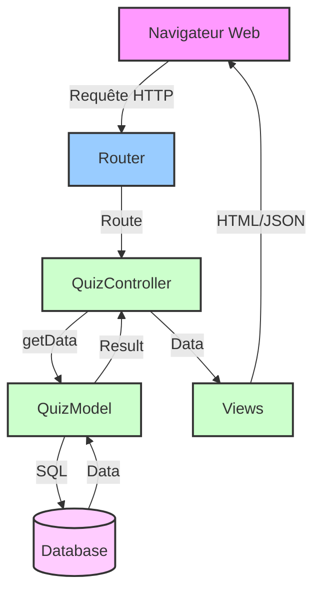

# Schéma d'Architecture - Quiz Master Dev

## Description du flux de la requête exemple

1. Le client envoie une requête POST avec des données JSON
2. Le Router reçoit la requête et analyse l'action demandée
3. La requête est dirigée vers QuizController
4. Le contrôleur valide les données et appelle le modèle
5. Le modèle interagit avec la base de données
6. Le résultat est renvoyé au contrôleur
7. La vue formate la réponse en JSON
8. La réponse est envoyée au client

liens : 
https://mermaid.live/edit#pako:eNqVVFlu2zAQvQrBIOgCx4u8RigCxDaCtIgKp3ZdoHI-aImyiUqkQlJZnfvE_e4NdLEOJVlWko-igiCQM2_eDGce9Yg94VNs45Uk8RrNxguO4Dk8RON0GzDONBMc-VQhpe9DqnK3FxKlxjRASyluFZUoYGFoHwTHQU1pKX5R-6Ddbhfro1vm67VtxXevgqMbrwj0Au9_An2iyZIoWkQfe_9KWx5qJKJYKMK1QrFk3GMxSQr2ofuV3LAV0TSR6AddXtm2XRwvB-RflSzzVjnzkXsqvTXT1NOJpMZwlWPMM3JHgmuZ_gmBT31aypPLhD1kNhGGVBrLd-B-aTn1I8b3JlMDdGnP6riO8NNnGMSOEfY03JGVm8uEKjO5zPCGZe7Ok5xhRqM4hCMrNDmfGMP5zLlojKbTxpfpizDK_WoXxkP3_dBMwIdXcJ5ucz7nfnp58cFE7mZUjYIBfKOQDgorhDRER0cnm1Yd7NdJ-ltTdD6bTTZolLtHmduqozGNCK_k2iAnRzgZol0hgAI2UN-uzszfAX-6VUmoiX4d2wX2kvVF3l7VM88988zTr6MJWZliHUg2rAjsjIEiqHwrr1I3Uy2TTDDuApfr7IYFRewCV3TkMwn6MpdwNtxbP7sM2nFXj9exaftEMK6R_44axW1pVYZnbsMr9aQaHw38QqzYdUJRlG41JGxU8A7gIyOaAnrqeemzKvtehc4BesPobYEspbTDZJLBNfizMB_bcFJawxGVETFb_GhAC6zXNKILbMPSpwGBCS3wgj9BWEz4TyGiXaQUyWqN7YCECnZJDPqiY0agp3sIZDQXKuEa2_1ORoHtR3yH7eNBfdDpdAYWfNq9TreG77HdbdY77X632eq2LKvX6nefavghS9msD8AOj9Wz2t2mBVzUZ1pkFwyKz_6ZT38BClS0Kw