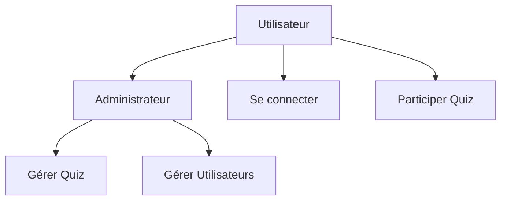

# 4. Spécifications Fonctionnelles

## 4.1 Description des Fonctionnalités

### Partie Utilisateur
- Création de compte et connexion
- Choix et participation aux quiz
- Consultation des résultats
- Modification du profil

### Partie Administration
- Gestion des utilisateurs (CRUD)
- Création et édition des quiz
- Visualisation des statistiques

## 4.2 Diagramme des Cas d'Utilisation



## 4.3 Description Détaillée

### Module Authentification
```php
// Exemple de code réel
public function login($email, $password) {
    $user = $this->userModel->findByEmail($email);
    if ($user && password_verify($password, $user['password'])) {
        $_SESSION['user_id'] = $user['id'];
        return true;
    }
    return false;
}
```

### Module Quiz
- Création/Modification/Suppression
- Gestion des questions et réponses
- Système de score