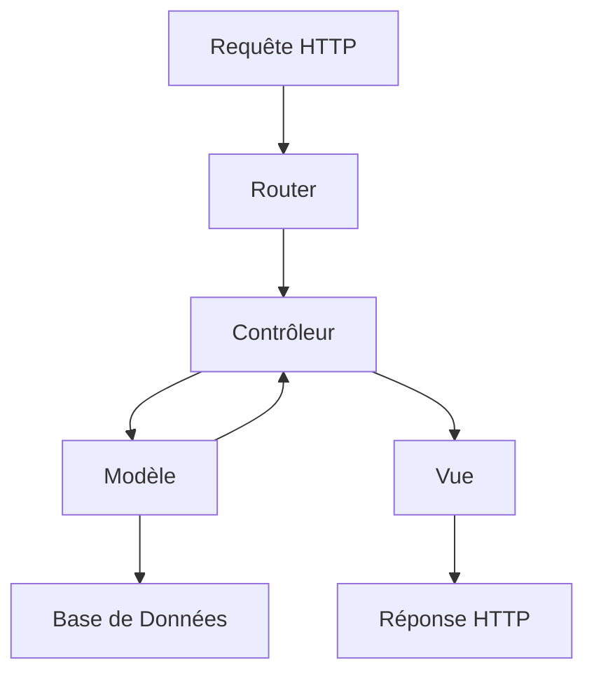

# 6. Architecture du Projet

## 6.1 Architecture MVC Personnalisée
En développant ce projet, j'ai choisi d'implémenter une architecture MVC personnalisée pour plusieurs raisons :

### Structure des Composants
- **Modèles (M)**
  ```php
  // Exemple de modèle Quiz
  class QuizModel extends BaseModel {
      private $table = 'quiz_quizzes';
      
      public function getActiveQuizzes() {
          // Logique métier pour récupérer les quiz actifs
      }
  }
  ```

- **Vues (V)**
  ```php
  <!-- Exemple de vue modulaire -->
  <main class="quiz-container">
      <?php foreach($quizzes as $quiz): ?>
          <?php include '_partials/quiz-card.php'; ?>
      <?php endforeach; ?>
  </main>
  ```

- **Contrôleurs (C)**
  ```php
  // Exemple de contrôleur avec gestion des erreurs
  class QuizController extends BaseController {
      public function show($id) {
          try {
              $quiz = $this->quizModel->find($id);
              $this->render('quiz/show', ['quiz' => $quiz]);
          } catch (Exception $e) {
              $this->handleError($e);
          }
      }
  }
  ```

## 6.2 Flux de Données
J'ai particulièrement travaillé sur l'optimisation du flux de données :



## 6.3 Gestion des Dépendances
Pour maintenir un code propre et modulaire, j'ai implémenté :

### Autoloading PSR-4
```php
// composer.json personnalisé
{
    "autoload": {
        "psr-4": {
            "App\\": "src/"
        }
    }
}
```

### Injection de Dépendances
```php
class QuizController {
    private $quizService;
    
    public function __construct(QuizService $quizService) {
        $this->quizService = $quizService;
    }
}
```

## 6.4 Organisation des Fichiers
J'ai structuré le projet de manière intuitive :

```plaintext
📁 src/
├── 📁 Controllers/
│   ├── QuizController.php
│   └── UserController.php
├── 📁 Models/
│   ├── QuizModel.php
│   └── UserModel.php
├── 📁 Services/
│   └── QuizService.php
└── 📁 Views/
    └── 📁 quiz/
        ├── index.php
        └── show.php
```

Cette organisation m'a permis de :
- Maintenir une séparation claire des responsabilités
- Faciliter l'ajout de nouvelles fonctionnalités
- Simplifier la maintenance du code