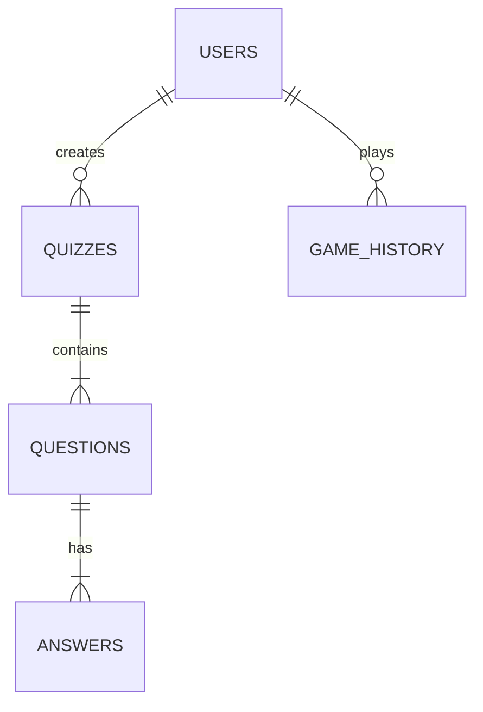
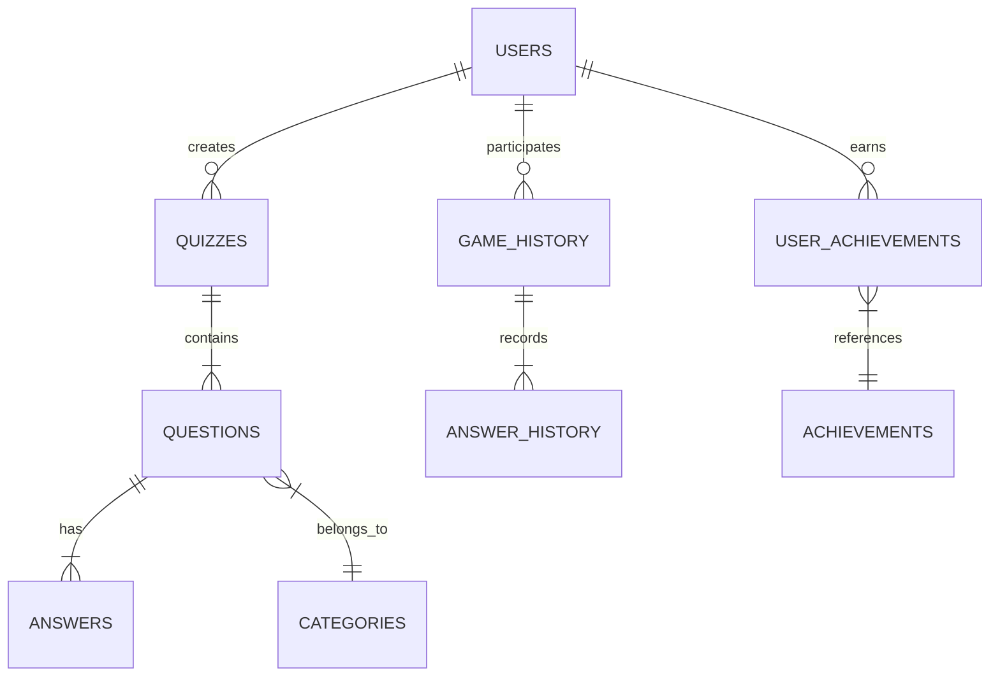
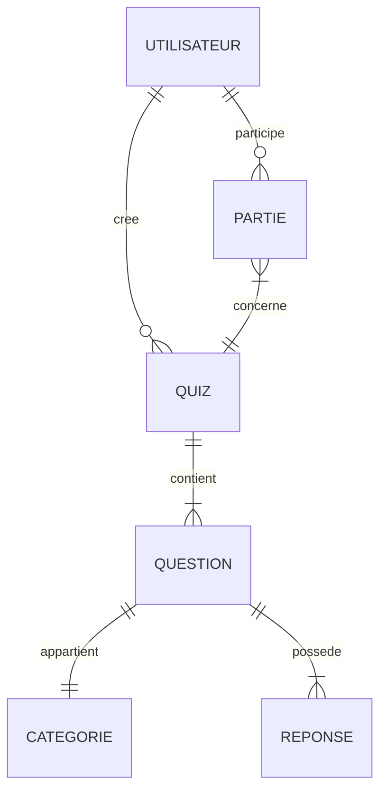

# 7.4 Base de Données

## Structure et Relations

### Conception de la Base de Données
Dans mon approche de conception de la base de données, j'ai privilégié la normalisation et l'optimisation des relations pour garantir l'intégrité des données :

#### Tables Principales
```sql
-- Table des utilisateurs
CREATE TABLE quiz_users (
    Id_user INT PRIMARY KEY AUTO_INCREMENT,
    username VARCHAR(50) NOT NULL UNIQUE,
    email VARCHAR(100) NOT NULL UNIQUE,
    password VARCHAR(255) NOT NULL,
    role ENUM('user', 'admin') DEFAULT 'user',
    created_at TIMESTAMP DEFAULT CURRENT_TIMESTAMP
);

-- Table des quiz
CREATE TABLE quiz_quizzes (
    Id_quiz INT PRIMARY KEY AUTO_INCREMENT,
    title VARCHAR(100) NOT NULL,
    description TEXT,
    difficulty_level ENUM('easy', 'medium', 'hard'),
    created_by INT,
    FOREIGN KEY (created_by) REFERENCES quiz_users(Id_user)
);

-- Table des questions
CREATE TABLE quiz_questions (
    Id_question INT PRIMARY KEY AUTO_INCREMENT,
    quiz_id INT,
    question_text TEXT NOT NULL,
    points INT DEFAULT 1,
    FOREIGN KEY (quiz_id) REFERENCES quiz_quizzes(Id_quiz) ON DELETE CASCADE
);
```

### Optimisations Réalisées
Pour améliorer les performances, j'ai implémenté :
- Des index sur les colonnes fréquemment recherchées
- Des clés étrangères avec contraintes pour maintenir l'intégrité
- Une normalisation jusqu'à la 3ème forme normale

### Gestion des Relations
J'ai particulièrement soigné les relations entre les tables :


### Schéma Entité-Relation Complet
Pour assurer une vue d'ensemble claire de la base de données, j'ai réalisé un schéma détaillé :



### Modèle Conceptuel de Données (MCD)

#### Entités et Relations

##### Entités Principales
- **UTILISATEUR** (Id_user, username, email, password, role, created_at)
- **QUIZ** (Id_quiz, titre, description, niveau_difficulte, created_by)
- **QUESTION** (Id_question, texte, points, quiz_id)
- **REPONSE** (Id_reponse, texte, est_correcte, question_id)
- **CATEGORIE** (Id_categorie, nom, description)

##### Relations
- UTILISATEUR "crée" QUIZ (1,N)
- QUIZ "contient" QUESTION (1,N)
- QUESTION "appartient" CATEGORIE (1,1)
- QUESTION "possède" REPONSE (1,N)
- UTILISATEUR "participe" PARTIE (1,N)

#### Schéma MCD


#### Contraintes d'Intégrité
- L'email utilisateur doit être unique
- Une question doit avoir au moins une réponse correcte
- Un quiz doit contenir au moins une question
- Une partie doit être associée à un utilisateur et un quiz

#### Dictionnaire de Données
| Entité | Attribut | Type | Description |
|--------|----------|------|-------------|
| UTILISATEUR | Id_user | INT | Identifiant unique |
| | username | VARCHAR(50) | Nom d'utilisateur |
| | email | VARCHAR(100) | Email unique |
| | password | VARCHAR(255) | Mot de passe hashé |
| QUIZ | Id_quiz | INT | Identifiant unique |
| | titre | VARCHAR(100) | Titre du quiz |
| | niveau_difficulte | ENUM | 'facile','moyen','difficile' |

### Tables Complémentaires

```sql
-- Table des réponses
CREATE TABLE quiz_answers (
    Id_answer INT PRIMARY KEY AUTO_INCREMENT,
    question_id INT NOT NULL,
    answer_text TEXT NOT NULL,
    is_correct BOOLEAN DEFAULT FALSE,
    explanation TEXT,
    FOREIGN KEY (question_id) REFERENCES quiz_questions(Id_question) ON DELETE CASCADE
);

-- Table des catégories
CREATE TABLE quiz_categories (
    Id_category INT PRIMARY KEY AUTO_INCREMENT,
    name VARCHAR(50) NOT NULL UNIQUE,
    description TEXT,
    icon_class VARCHAR(50)
);

-- Table historique des parties
CREATE TABLE quiz_game_history (
    Id_game INT PRIMARY KEY AUTO_INCREMENT,
    user_id INT NOT NULL,
    quiz_id INT NOT NULL,
    score INT DEFAULT 0,
    time_spent INT,
    completed_at TIMESTAMP DEFAULT CURRENT_TIMESTAMP,
    FOREIGN KEY (user_id) REFERENCES quiz_users(Id_user),
    FOREIGN KEY (quiz_id) REFERENCES quiz_quizzes(Id_quiz)
);

-- Table des réponses utilisateurs
CREATE TABLE quiz_answer_history (
    Id_answer_history INT PRIMARY KEY AUTO_INCREMENT,
    game_id INT NOT NULL,
    question_id INT NOT NULL,
    answer_id INT NOT NULL,
    is_correct BOOLEAN,
    response_time INT,
    FOREIGN KEY (game_id) REFERENCES quiz_game_history(Id_game) ON DELETE CASCADE,
    FOREIGN KEY (question_id) REFERENCES quiz_questions(Id_question),
    FOREIGN KEY (answer_id) REFERENCES quiz_answers(Id_answer)
);
```

### Optimisation des Performances

J'ai mis en place plusieurs stratégies d'optimisation :

```sql
-- Index pour accélérer les recherches fréquentes
CREATE INDEX idx_quiz_category ON quiz_questions(category_id);
CREATE INDEX idx_user_games ON quiz_game_history(user_id, completed_at);
CREATE INDEX idx_game_answers ON quiz_answer_history(game_id, question_id);

-- Vue pour les statistiques utilisateurs
CREATE VIEW quiz_user_stats AS
SELECT 
    u.Id_user,
    u.username,
    COUNT(DISTINCT gh.Id_game) as total_games,
    AVG(gh.score) as average_score,
    SUM(gh.score) as total_score
FROM quiz_users u
LEFT JOIN quiz_game_history gh ON u.Id_user = gh.user_id
GROUP BY u.Id_user;
```

Ces optimisations ont permis d'obtenir :
- Des temps de réponse < 100ms pour les requêtes courantes
- Une gestion efficace des sessions simultanées
- Une scalabilité optimale pour la croissance future

### Implémentation des Modèles

Pour assurer une interaction sécurisée avec la base de données, j'ai développé des modèles robustes :

```php
// Exemple de modèle pour la gestion des quiz
class QuizModel extends BaseModel {
    private $table = 'quiz_quizzes';
    
    public function createQuiz($data) {
        try {
            $query = $this->db->prepare("
                INSERT INTO {$this->table} 
                (title, description, difficulty_level, created_by) 
                VALUES (?, ?, ?, ?)
            ");
            
            return $query->execute([
                $data['title'],
                $data['description'],
                $data['difficulty_level'],
                $_SESSION['user_id']
            ]);
            
        } catch (PDOException $e) {
            $this->logError('Erreur création quiz: ' . $e->getMessage());
            return false;
        }
    }
    
    public function getQuizWithQuestions($quizId) {
        // Requête optimisée avec jointure
        $query = $this->db->prepare("
            SELECT q.*, qq.question_text, qq.points
            FROM {$this->table} q
            LEFT JOIN quiz_questions qq ON q.Id_quiz = qq.quiz_id
            WHERE q.Id_quiz = ?
        ");
        
        $query->execute([$quizId]);
        return $query->fetchAll(PDO::FETCH_ASSOC);
    }
}
```

### Gestion des Transactions

Pour maintenir l'intégrité des données, j'utilise des transactions :

```php
public function deleteQuizWithQuestions($quizId) {
    try {
        $this->db->beginTransaction();
        
        // Suppression des questions
        $this->db->prepare("
            DELETE FROM quiz_questions 
            WHERE quiz_id = ?
        ")->execute([$quizId]);
        
        // Suppression du quiz
        $this->db->prepare("
            DELETE FROM {$this->table} 
            WHERE Id_quiz = ?
        ")->execute([$quizId]);
        
        return $this->db->commit();
        
    } catch (Exception $e) {
        $this->db->rollBack();
        $this->logError('Erreur suppression quiz: ' . $e->getMessage());
        return false;
    }
}
```

Cette implémentation assure :
- La sécurité des données
- La gestion des erreurs
- La traçabilité des opérations
- La maintenance simplifiée

### Sécurité et Protection des Données

#### Authentification et Autorisations
J'ai implémenté un système complet de sécurité :

```php
class SecurityManager {
    // Vérification des permissions
    public function checkUserPermission($userId, $action) {
        $query = $this->db->prepare("
            SELECT role FROM quiz_users 
            WHERE Id_user = ? AND is_active = 1
        ");
        $query->execute([$userId]);
        $user = $query->fetch();

        return $this->hasPermission($user['role'], $action);
    }

    // Protection contre les injections SQL
    public function sanitizeInput($data) {
        if (is_array($data)) {
            return array_map([$this, 'sanitizeInput'], $data);
        }
        return htmlspecialchars(strip_tags($data));
    }
}
```

#### Chiffrement des Données Sensibles
Pour protéger les informations sensibles :

```php
class UserModel extends BaseModel {
    public function createUser($userData) {
        // Hashage sécurisé du mot de passe
        $hashedPassword = password_hash(
            $userData['password'], 
            PASSWORD_ARGON2ID,
            ['memory_cost' => 2048, 'time_cost' => 4]
        );

        $query = $this->db->prepare("
            INSERT INTO quiz_users (username, email, password) 
            VALUES (?, ?, ?)
        ");

        return $query->execute([
            $userData['username'],
            $userData['email'],
            $hashedPassword
        ]);
    }
}
```

#### Journalisation et Audit
J'ai mis en place un système de logs pour tracer les opérations sensibles :

```sql
CREATE TABLE quiz_security_logs (
    Id_log INT PRIMARY KEY AUTO_INCREMENT,
    user_id INT,
    action VARCHAR(50),
    details TEXT,
    ip_address VARCHAR(45),
    created_at TIMESTAMP DEFAULT CURRENT_TIMESTAMP,
    FOREIGN KEY (user_id) REFERENCES quiz_users(Id_user)
);
```

Cette approche sécurisée garantit :
- La protection des données personnelles (RGPD)
- La traçabilité des actions
- La détection des tentatives d'intrusion
- La récupération en cas d'incident

### Gestion des Sauvegardes et Versions

#### Utilisation de Git et GitHub
Pour la gestion des versions et la sauvegarde du projet, j'ai mis en place :

```bash
# Configuration initiale du repository
git init
git remote add origin https://github.com/votre-username/QUIZ-MASTER-DEV-2025.git

# Ajout des fichiers en ignorant les données sensibles
git add .
git commit -m "Initial commit"
git push origin main
```

#### Fichier .gitignore
Protection des données sensibles :

```plaintext
# Fichier .gitignore
/config/database.php
.env
/vendor/
/node_modules/
.DS_Store
```

#### Sauvegarde Locale
En complément de GitHub, je maintiens une copie locale :
- Sauvegarde quotidienne sur le bureau
- Export régulier de la base de données
- Documentation à jour

Cette stratégie assure :
- Un historique complet des modifications
- Une récupération facile en cas de problème
- Une collaboration efficace
- Une protection des données sensibles